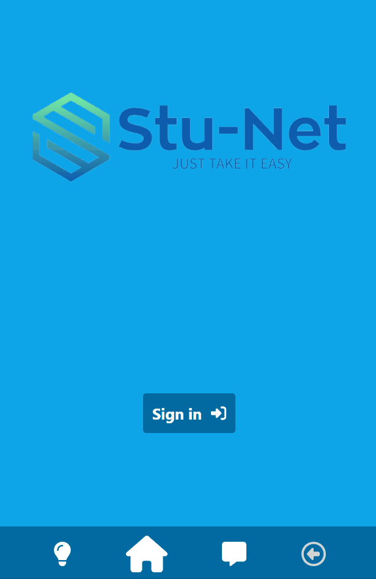
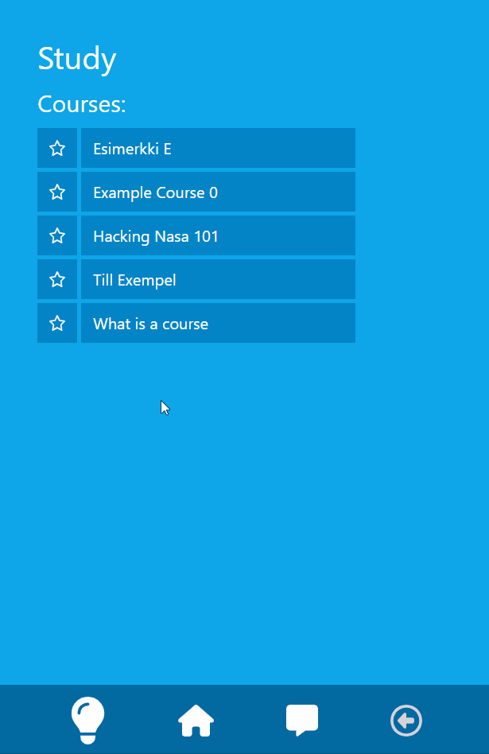

# Don't fail UPC - HackUPC 2023 Submission

#### You may not be the best student in the class, but we are confident that you can make the most of your abilities and create great projects together with your most compatible classmates.

#### Share your class notes, build teams faster, and work for success.

## How to run:

Authorizing admins relies on an Auth0 action that adds app_metadata for each user to their id_token. To do this:

- Run `node svelte-app/deploy-auth0.js`
- Enter the Management API token from `Applications -> APIs -> Auth0 Management API -> API Explorer`
- Enter the Client ID for `Applications -> Applications -> Default App`
- Add your production url to `Allowed Callback URLs`, `Allowed Logout URLs` and `Allowed Web Origins`

You also need the certificates for your domain. Add them to this folder as fullchain.pem and privkey.pem

In your .env, set the following variables:
- AUTH0_PUBKEY - use `openssl x509 -in mycert.pem -noout -pubkey`, where mycert.pem is the AUTH0_CERT from deploy-auth0.js
- AUTH0_DOMAIN - from deploy-auth0.js
- OPENAI_API_KEY - for grading the notes
- ORIGIN_URL - what the browser sees the URL as (used for SvelteKit's CSRF protection)

Run `docker compose up --abort-on-container-exit`

## Development

See docker-compose.yml for the environment variables you need to set when running the development servers outside of docker-compose. When developing one of the services, you can run the other services with development servers or use their Dockerfiles. The commands for running a development server are listed below:
- websocket-serve: `cargo run`
- sveltekit-app: `npm run dev`
- scoring-api: `python flask_app.py`

### Adminstration

After signing in into the app, set your own users app_metadata in Auth0 User Management to `{"admin":true}`. You can now edit course information and post the source text for lectures.

###  Authors

- Miika Tuominen (sveltekit-app)
- Júlia Alós (websocket-server)
- Àlex Amat (scoring-api Flask code)
- Alessio Sordo (scoring-api neutral network)

  

### Preview

 
 
 

